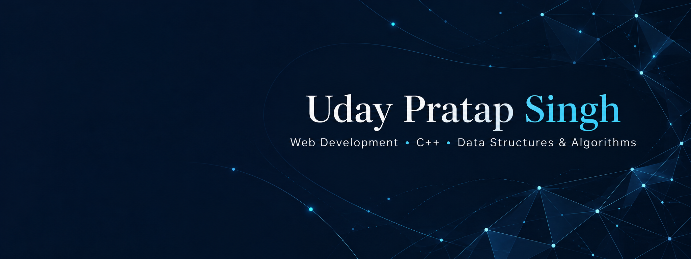

# Hi, I’m Uday Pratap Singh

**Computer Science & Engineering student · Web development · C++ and algorithms**

I’m pursuing a B.Tech at Lovely Professional University after completing a Diploma in Computer Science at GLA University. I enjoy turning programming concepts into interactive, useful applications.

## What I work with

- **Web:** HTML, CSS, JavaScript, responsive interfaces
- **Programming:** C, C++, Java, Python
- **Tools:** Git, GitHub, VS Code
- **Learning focus:** Data structures, algorithms, object-oriented programming, and complexity analysis

## Selected projects

| Project | What I built |
| --- | --- |
| **VocaBuddy** | A vocabulary learning web application developed with a team, with interactive discovery and practice features. |
| **Algorithm Visualizer** | Step-by-step sorting and searching visualizations for understanding algorithm execution. |
| **Personal Expense Tracker** | Income and expense management with transaction categories, balance calculations, and LocalStorage. |

## Code and coursework

Explore [LiftX](https://github.com/upratapsingh44/LiftX), my collection of programming practice and coursework in C, C++, Java, data structures, and web development.

## Connect

I’m interested in connecting with developers and teams building useful applications, and in opportunities to contribute while developing my software engineering skills.

[LinkedIn](https://www.linkedin.com/in/upratapsingh44/)
